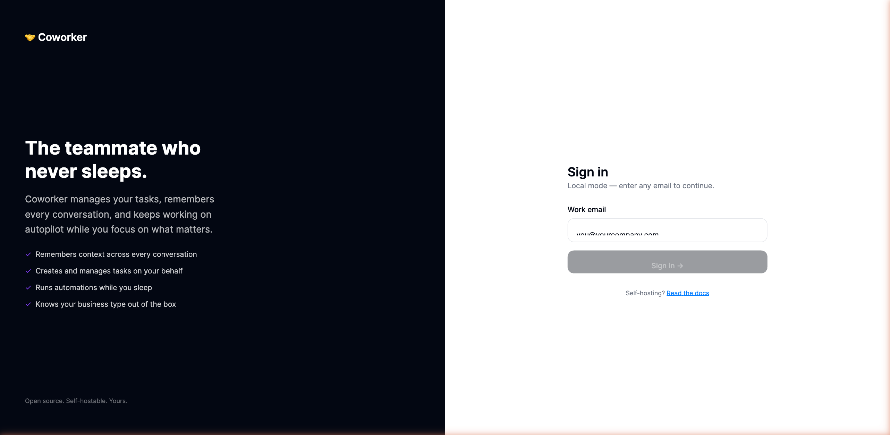
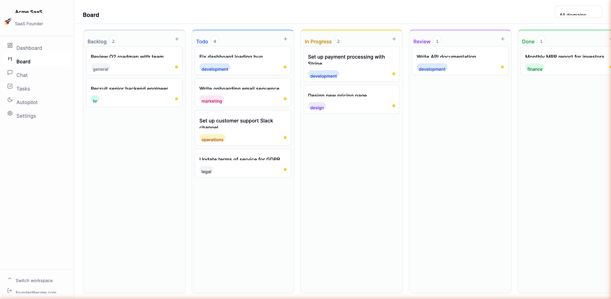
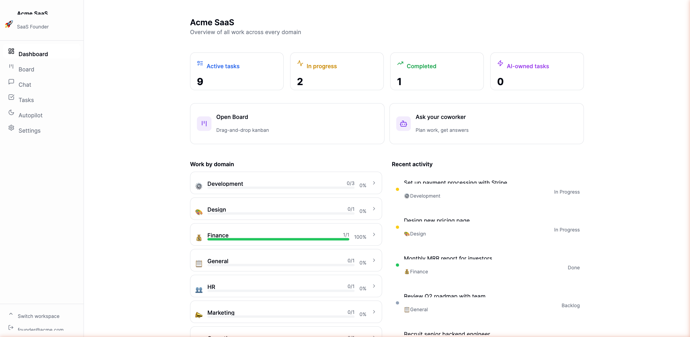
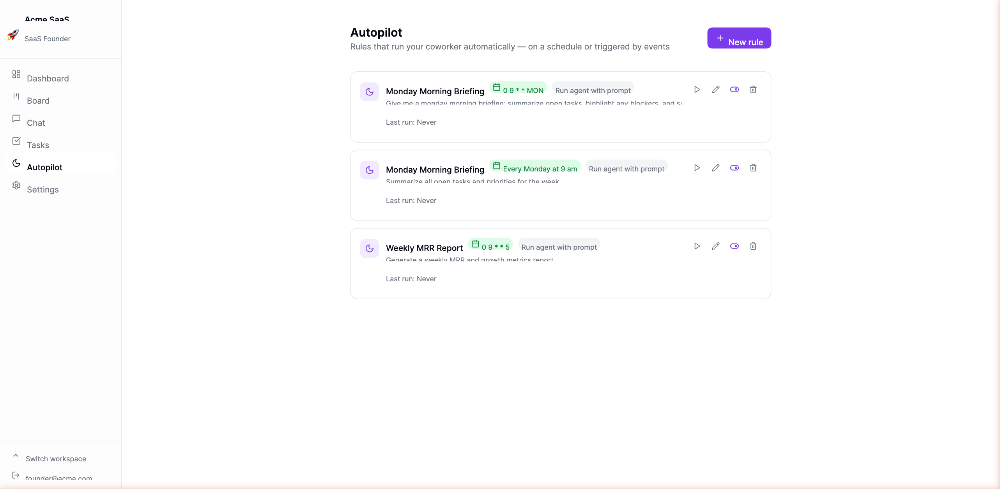

# Coworker

**The teammate who never sleeps.**

[](https://github.com/arunrajiah/coworker/actions/workflows/ci.yml)
[](LICENSE)
[](https://pnpm.io/)
[](https://www.typescriptlang.org/)

Coworker is an open-source AI coworker for founders. It manages tasks, remembers context across every conversation, and keeps working on autopilot while you focus on what matters.

---

## What makes it different

- **Founder templates** — picks up your business context from day one (SaaS, Agency, Ecommerce, Consulting, Freelancer). Your coworker talks in your language.
- **Memory that persists** — every conversation is embedded and retrieved via pgvector. Your coworker remembers what you told it last month.
- **Autopilot** — schedule automations (weekly briefings, Friday wrap-ups, Monday planning) that run whether or not you open the app.
- **One command to self-host** — Postgres + Redis + 3 services via Docker Compose.
- **Provider-agnostic** — works with Anthropic Claude, OpenAI, Google, Groq, Mistral, or local Ollama. Switch per-workspace, no redeploy needed.

---

## Features at a glance

### Task management
- **Kanban board** with drag-and-drop between columns (Backlog → Todo → In Progress → Review → Done). Drag shows an **Undo** toast so you can revert in one click.
- **Task detail modal** — click any card or list row to edit title, description, status, priority, domain, and due date inline. Two-step delete confirmation.
- **List view** with status cycling (click the icon to advance) and real-time search by title, description, or domain.
- **Due dates** on task creation directly from the board and list.

### AI chat
- **Persistent threads** — every conversation is remembered. Pick up where you left off.
- **Starter prompts** — template-aware suggestions on empty threads; click one to send immediately.
- **File attachments** — attach PDFs, images, and text files. The agent reads them in context.
- **Real-time status** — tool-in-progress indicator shows exactly what the agent is doing. "This is taking longer than usual…" appears after 20 seconds.

### Skills
- **Custom skills** extend your coworker with specific instructions, personas, or output formats.
- Trigger by phrase (e.g. `/standup`) or keep always-active.
- Manageable from the dedicated **Skills** page in the main nav.

### Autopilot
- **Scheduled rules** — run the agent on a cron schedule (daily briefings, weekly reports).
- **Event triggers** — fire on `task_created`, `task_status_changed`, `git_issue_opened`, and more.

### Integrations
- **Git** — GitHub, GitLab, Bitbucket issue sync + webhook triggers. Issues become kanban tasks automatically.
- **Vercel** — monitor deployments and trigger deploys from the agent or autopilot.
- **Telegram** — chat with your coworker from any device.
- All managed from **Settings** (tabbed: General · AI Model · Git · Vercel · Telegram · Files).

### UX
- **Dark mode** — Sun/Moon toggle in the sidebar, persisted to `localStorage`, no flash on load.
- **⌘K** — opens a new chat from anywhere in the app.
- **Toast notifications** — success and error feedback on every mutation.
- **Getting-started checklist** — one-time widget on the dashboard guides new users through first setup steps.
- **Error boundaries** — a component crash shows a "Try again" UI instead of a blank screen.

---

## Quick start

```bash
# 1. Clone + copy env
git clone https://github.com/arunrajiah/coworker
cd coworker
cp .env.example .env

# 2. Add your LLM key (Anthropic or OpenAI — at least one required)
# Edit .env: ANTHROPIC_API_KEY=sk-ant-... or OPENAI_API_KEY=sk-...

# 3. Generate an auth secret
openssl rand -hex 32   # paste as AUTH_SECRET in .env

# 4. Start everything
docker compose -f infra/docker/docker-compose.oss.yml up -d

# 5. Run migrations
docker compose -f infra/docker/docker-compose.oss.yml exec api \
  node -e "import('./src/migrate.js')"

# 6. Open
open http://localhost:3000
```

---

## Architecture

Three processes. One purpose.

```
web (Next.js 15)  ──┐
                     ├──▶  api (Hono)  ──▶  PostgreSQL + pgvector
worker (BullMQ)  ──┘              │
    │                             └──▶  Redis (job queue + pub/sub)
    └──▶  Vercel AI SDK (Anthropic / OpenAI)
```

| Layer | Technology | Why |
|---|---|---|
| Frontend | Next.js 15 App Router | Streaming, RSC, fast |
| API | Hono + Node.js | Type-safe, composable middleware |
| Agent runtime | Vercel AI SDK | Provider-agnostic, tool use, streaming |
| Job queue | BullMQ + Redis | Durable agent runs, cron autopilot |
| Database | PostgreSQL 16 + pgvector | Relational + semantic memory in one |
| ORM | Drizzle | SQL-first, type-safe, migrations |
| Auth | Magic link + JWT | No password friction |

---

## Project structure

```
coworker/
├── apps/
│   ├── web/       Next.js 15 frontend
│   ├── api/       Hono API (auth, workspaces, tasks, chat, skills, autopilot)
│   └── worker/    BullMQ agent executor + autopilot scheduler
├── packages/
│   ├── core/      Adapter interfaces + all 5 founder templates
│   ├── db/        Drizzle schema + migrations (platform + tenant with RLS)
│   ├── config/    Zod env validation
│   └── adapters/  OSS implementations (local storage, SMTP, no-op billing)
└── infra/
    └── docker/    Docker Compose OSS
```

---

## Founder templates

Pick your business type when you create a workspace. Your coworker arrives pre-configured with context-aware skills and autopilot rules.

| Type | What your coworker understands |
|---|---|
| SaaS | MRR, churn, activation, sprint planning |
| Agency | Client retainers, utilization, proposals |
| Ecommerce | AOV, ROAS, inventory, campaigns |
| Consulting | Engagements, deliverables, pipeline |
| Freelancer | Projects, invoices, deadlines |

---

## How the agent works

Every message you send runs through a durable BullMQ job:

1. Message saved to DB → job enqueued
2. Worker builds system prompt: base + template context + active skills + recent memories + open tasks
3. `generateText` with tools (`create_task`, `search_tasks`, `update_task`) — up to 10 steps
4. Response + tool calls saved to DB, broadcast via Redis pub/sub → WebSocket → browser

Memory is stored as pgvector embeddings and retrieved by cosine similarity on every turn.

---

## Autopilot

Create rules that run on a schedule or on events. A rule has:

- **Trigger**: cron schedule (e.g. every Monday 9am) or event hook
- **Action**: run the agent with a prompt, or create a task directly

Rules are synced to BullMQ repeatable jobs on startup and whenever you change them. If the worker restarts, all jobs are re-synced from the DB.

---

## Development

```bash
pnpm install

# Start Postgres + Redis
docker compose -f infra/docker/docker-compose.oss.yml up postgres redis -d

# Run migrations
cd packages/db && pnpm db:migrate && cd ../..

# Start all services
pnpm dev
```

Ports: web → 3000, api → 3001

---

## Screenshots

| Login | Board | Dashboard | Autopilot |
|---|---|---|---|
|  |  |  |  |

---

## Environment variables

| Variable | Required | Description |
|---|---|---|
| `DATABASE_URL` | Yes | Postgres connection string |
| `REDIS_URL` | Yes | Redis connection string |
| `AUTH_SECRET` | Yes | 32+ byte secret for JWT signing |
| `ANTHROPIC_API_KEY` | One of | Claude models |
| `OPENAI_API_KEY` | One of | OpenAI models |
| `APP_URL` | Yes | Frontend origin (e.g. `http://localhost:3000`) |
| `API_URL` | Yes | API origin (e.g. `http://localhost:3001`) |
| `SMTP_URL` | No | SMTP connection string — magic links print to logs if unset |
| `EMAIL_FROM` | No | From address for magic link emails |
| `UPLOAD_DIR` | No | Local file storage path (default: `./uploads`) |
| `LOCAL_AUTH` | No | `true` to skip email verification (self-hosted single-user) |
| `NEXT_PUBLIC_LOCAL_AUTH` | No | Must match `LOCAL_AUTH` — controls login page copy |
| `TELEGRAM_BOT_TOKEN` | No | Enables Telegram integration |

---

## Local auth (no email required)

For self-hosted single-user deployments you don't want to deal with email setup. Set `LOCAL_AUTH=true` (and `NEXT_PUBLIC_LOCAL_AUTH=true`) and the login page skips email verification — entering any email address signs you in or creates your account immediately.

```bash
# .env
LOCAL_AUTH=true
NEXT_PUBLIC_LOCAL_AUTH=true
```

> **Never enable this in a multi-user or public deployment.** It lets anyone create an account without email verification.

---

## Self-hosting checklist

- [ ] Set `AUTH_SECRET` to 32+ random bytes (`openssl rand -hex 32`)
- [ ] Set at least one LLM key (`ANTHROPIC_API_KEY` or `OPENAI_API_KEY`)
- [ ] Set `POSTGRES_PASSWORD` to something strong
- [ ] Set `APP_URL` and `API_URL` to your domain
- [ ] Set up a reverse proxy (nginx/Caddy) with HTTPS
- [ ] (Optional) Set `SMTP_URL` for real email — or use `LOCAL_AUTH=true` for single-user installs

---

## Contributing

Contributions are welcome. Please read [CONTRIBUTING.md](CONTRIBUTING.md) before submitting a PR.

**Good first issues** are labeled [`good first issue`](https://github.com/arunrajiah/coworker/issues?q=is%3Aissue+is%3Aopen+label%3A%22good+first+issue%22).

---

## Keyboard shortcuts

| Shortcut | Action |
|---|---|
| `⌘K` / `Ctrl+K` | Open a new chat thread from anywhere |
| `Enter` | Send message in chat |
| `Shift+Enter` | New line in chat input |
| `Escape` | Close modals and inline forms |

---

## Telegram integration

Connect your coworker to a Telegram bot so you can message it from anywhere.

**Setup:**
1. Create a bot with [@BotFather](https://t.me/BotFather) on Telegram — copy the token
2. Set `TELEGRAM_BOT_TOKEN` in your `.env`
3. Restart the worker
4. In your workspace **Settings → Telegram**, click **Connect Telegram** to get a code
5. Send `/connect <code>` to your bot — done

Messages you send to the bot go through the same agent loop as the web app. Responses come back to Telegram automatically.

---

## File uploads

Upload PDFs, images, and text files to your workspace from **Settings → Files**. Attached files show up in the agent's context when you include them in a message using the paperclip icon in the chat input. The agent can also list your uploaded files with the `list_files` tool.

---

## Roadmap

- [x] Telegram integration
- [x] File uploads
- [x] Git integrations (GitHub, GitLab, Bitbucket)
- [x] Vercel deployment integration
- [x] Multi-provider LLM support (Anthropic, OpenAI, Google, Groq, Mistral, Ollama)
- [x] Task detail modal with inline editing
- [x] Dark mode
- [x] Skills management (dedicated page, trigger phrases)
- [x] Settings tab navigation + workspace rename
- [ ] WhatsApp / Slack integration
- [ ] PDF text extraction + image vision
- [ ] More founder templates (Creator, Real estate)
- [ ] Public skills marketplace
- [ ] Team / multi-user workspaces
- [ ] Mobile app

---

## License

[MIT](LICENSE) — build on it, ship it, make it yours.
